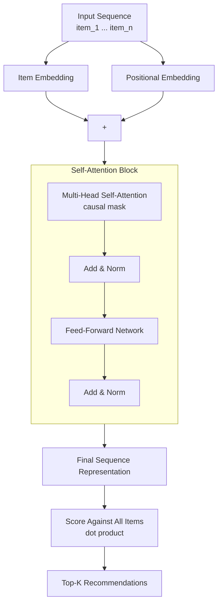

# SASRec Recommender

A PyTorch implementation of a self-attention based sequential recommender. Given a user's ordered interaction history, the model predicts what they are likely to interact with next.

Trained and evaluated end to end on MovieLens-1M (6,040 users, 3,416 items, ~1M interactions).

**Test HR@10: 0.7371 | Test NDCG@10: 0.4793**

---

## Overview

Most recommendation models treat a user's history as an unordered set of likes. That throws away information: what someone watched *last week* usually says more about what they want *next* than what they watched two years ago.

This system treats user history as a time-ordered sequence and uses self-attention to learn which past interactions actually matter for predicting the next one, without the sequential bottleneck of an RNN.

## Pipeline

```mermaid
flowchart LR
    A[Raw MovieLens Data] --> B[Preprocessing]
    B --> C[Sequential Dataset]
    C --> D[Train / Val / Test Split]
    D --> E[SASRec Training]
    E --> F[Evaluation<br/>HR@10 / NDCG@10]
    E --> G[Qualitative Recommendations]
    F --> H[Best Checkpoint]
    G --> H
```

**Preprocessing** filters users/items with fewer than 5 interactions, remaps IDs to contiguous integers, and sorts each user's history chronologically.

**Splitting** follows a leave-one-out protocol per user: the last item is held out for test, the second-to-last for validation, and everything before that is used for training.

**Training** dynamically samples negative items each step and optimizes a binary cross-entropy loss over positive vs. negative next-item pairs.

**Evaluation** ranks the true next item against 100 sampled negatives and reports HR@10 and NDCG@10.

## Architecture



Key design points:

- **Positional embeddings** are added to item embeddings since self-attention has no inherent notion of order.
- **Causal masking** prevents a position from attending to future items, so the model only ever conditions on past interactions.
- **Residual connections + layer norm** around both the attention and feed-forward sub-layers stabilize training across stacked blocks.
- **Shared item embeddings** are used for both the input side and the output scoring layer, reducing parameter count and overfitting risk.

## Results

Trained with an Adam optimizer for 200 epochs (batch size 128) on a Tesla T4 GPU.

| Split | HR@10 | NDCG@10 |
|---|---|---|
| Validation | 0.7632 | 0.4960 |
| Test | 0.7371 | 0.4793 |

### Ablation: sequence length vs. dropout

A controlled 2x2 experiment isolating the effect of maximum sequence length (`maxlen`) and dropout rate, holding every other hyperparameter fixed.

| maxlen | dropout | Test HR@10 | Test NDCG@10 |
|---|---|---|---|
| 50 | 0.5 | 0.6781 | 0.4148 |
| 50 | **0.2** | 0.7154 | 0.4518 |
| **200** | 0.5 | 0.6964 | 0.4384 |
| **200** | **0.2** | **0.7371** | **0.4793** |

Reducing dropout alone produced a larger isolated gain than extending sequence length alone, suggesting the original config was over-regularized for a fairly dense dataset. Combining both changes gave the best result. Full experiment records live in `results/evaluation.json`.

## Qualitative Example

Generated by `scripts/qualitative_examples.py` on the best checkpoint.

```text
==========================================
User ID: 1
==========================================
Recent Watch History:
  Strongly composed of animation / children's movies

Top-5 Recommended Movies:
  1. The Lion King
  2. The Little Mermaid
  3. Fantasia
  4. The Jungle Book
  5. Lady and the Tramp
```

The model picks up on the user's genre pattern from their history alone, with no explicit genre features fed into the model. Full output for all evaluated users is in `results/qualitative_examples.txt`.

## Installation

Requires Python 3.11+.

```bash
pip install -r requirements.txt
```

## Usage

**Train:**
```bash
python scripts/train.py \
    --epochs 200 --maxlen 200 --dropout 0.2 \
    --batch-size 128 --hidden-units 50 \
    --num-blocks 2 --num-heads 1 \
    --lr 0.001 --seed 42 --device cuda
```

**Evaluate a checkpoint:**
```bash
python scripts/evaluate.py --checkpoint results/checkpoints/sasrec_movielens_maxlen200_dropout02.pt
```

**Generate qualitative recommendations:**
```bash
python scripts/qualitative_examples.py
```

## Project Structure

```text
sasrec-recommender/
├── configs/
│   └── default.yaml
├── data/
│   ├── raw/
│   └── processed/
├── results/
│   ├── checkpoints/
│   ├── evaluation.json
│   └── qualitative_examples.txt
├── scripts/
│   ├── train.py
│   ├── evaluate.py
│   └── qualitative_examples.py
├── src/
│   ├── data/
│   ├── evaluation/
│   ├── models/
│   └── training/
├── requirements.txt
└── README.md
```

## Reproducibility

All experiments use a fixed random seed (`42`). Pass `--seed 42` to reproduce reported numbers, and configure PyTorch for deterministic operations if exact bit-for-bit reproduction is needed.

## Limitations

- **Cold start:** users/items with fewer than 5 interactions are filtered out during preprocessing; the model has no mechanism for handling brand-new users or items without retraining.
- **No side information:** the model only uses item IDs and sequence order. Genres, timestamps, and user demographics are not incorporated.
- **Fixed max context:** sequences longer than `maxlen` are truncated to the most recent items, so very long-term dependencies beyond that window are not modeled.

## Possible Future Work

- Incorporate item features (genres, metadata) into the embedding layer to improve cold-item performance.
- Explore sparse or memory-augmented attention for handling sequences longer than the current max length.
